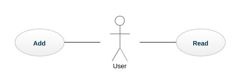
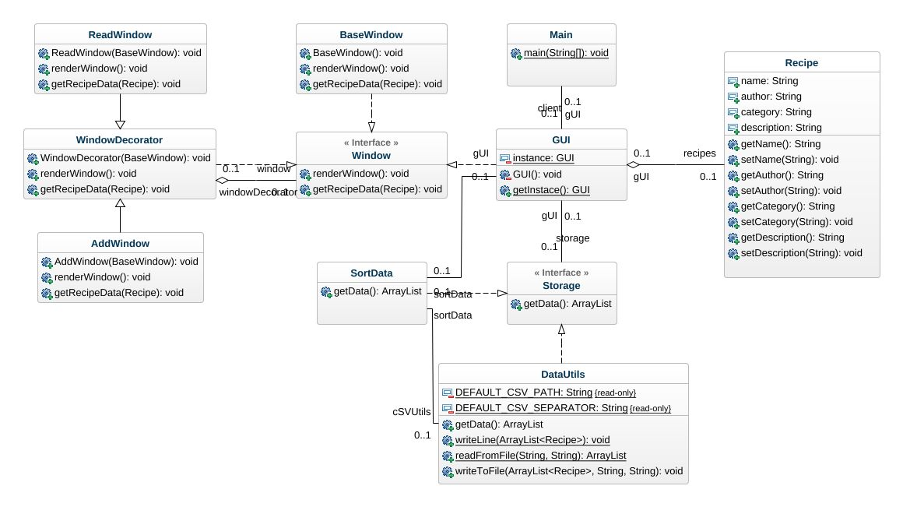
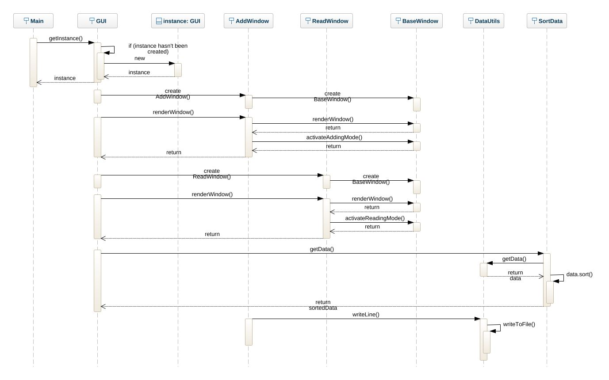

# Kitchen Pal

> Simple desktop java application built for exercising Design Patterns.

## Design Patterns used:
- [Singleton](https://en.wikipedia.org/wiki/Singleton_pattern) is used to create/get instance of Main UI. /GUI.java/
- [Proxy](https://en.wikipedia.org/wiki/Proxy_pattern) is used to write/get/sort data from/to .csv file.
- [Decorator](https://en.wikipedia.org/wiki/Decorator_pattern) is used for decorating a base window for different purposes. /Reading & Adding/

## Diagrams 

### Use Case

### Class

### Sequence

## License
&copy; [MIT](./license "View License!") 2019 &mdash; [Byurhan Beyzat](https://github.com/byurhanbeyzat) &amp; Antonio Iliev